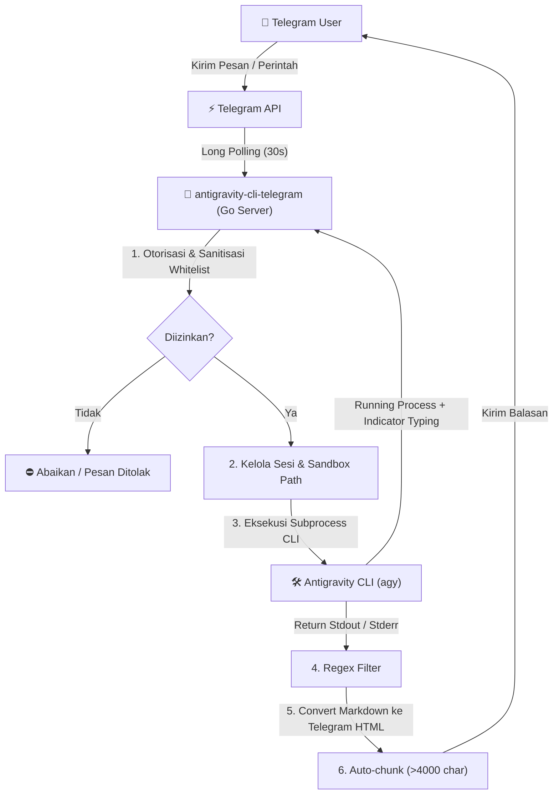

# 🤖 Antigravity CLI Telegram Gateway

Gateway Telegram berbasis Bahasa **Go** untuk menghubungkan Telegram Bot dengan **Antigravity CLI (`agy`)**. Aplikasi ini memungkinkan Anda untuk menjalankan tugas agen AI, mengelola file, mengeksekusi perintah coding, dan berinteraksi secara *remote* dengan Antigravity CLI langsung dari obrolan Telegram.

---

## 🌟 Fitur Utama

- **Keamanan Sandbox**: Membatasi lokasi operasi agen hanya pada folder yang diizinkan (`ALLOWED_DIRS`) dan mencegah serangan *Path Traversal* (`../`).
- **Autentikasi Whitelist**: Membatasi akses bot hanya untuk ID Pengguna (`ALLOWED_USER_IDS`) atau ID Chat/Grup (`ALLOWED_CHAT_IDS`) tertentu.
- **Manajemen Sesi Pengguna**: Menjaga konteks percakapan bertahap (*multi-turn conversation*) per pengguna secara aman dan terisolasi (*thread-safe*).
- **Perintah Spesial (Slash Commands)**:
  - `/new`: Mereset sesi obrolan dan memulai percakapan baru.
  - `/dir`: Mengubah atau membuat direktori kerja baru dalam lingkungan Sandbox.
  - `/goal`: Menjalankan tugas kompleks tanpa terputus secara *background process*.
  - `/grill_me`: Bot akan bertanya balik untuk memperjelas kebutuhan sebelum dieksekusi.
  - `/browser`: Memaksa agen menggunakan peramban web (*web browser*).
  - `/schedule`: Menjadwalkan pengingat atau tugas otomatis.
- **Tampilan Rapi untuk Ponsel**:
  - Konversi otomatis dari Markdown ke tag HTML Telegram (`<b>`, `<i>`, `<code>`, `<pre>`).
  - *Auto-chunking*: Memotong pesan jawaban yang melebihi batas 4000 karakter menjadi beberapa bagian secara otomatis.
  - *Thought process filtering*: Menyaring pemikiran internal agen (`<BOT_REPLY>`) sehingga pengguna hanya menerima jawaban akhir yang bersih.
- **Indikator Aktif**: Mengirim indikator status *"typing..."* secara periodik saat proses berat berjalan agar pengguna tahu agen masih bekerja.

---

## ⚙️ Cara Kerja Sistem (Architecture & Workflow)

Secara arsitektur, aplikasi ini terdiri dari komponen utama **main.go** dan **telegram.go**:



### Tahapan Eksekusi:
1. **Long Polling Loop**: `GetUpdates()` menerima pesan baru dari Telegram secara terus-menerus.
2. **Otorisasi & Filter Grup**: Memeriksa apakah pengirim pesan terdaftar pada whitelist. Jika di dalam grup, bot hanya merespons jika di-*mention* (`@botname`) atau menggunakan perintah slash.
3. **Manajemen Sesi**: Membuka data `SessionState` milik pengguna secara *thread-safe* (`sync.RWMutex`). Mengatur flag `-c` (continue context) dan memantau timeout keaktifan sesi (auto-reset jika tidak aktif > 2 jam).
4. **Subprocess Execution**: Memanggil CLI `agy` menggunakan paket `os/exec`. Menginjeksi *system prompt* rahasia untuk memaksa jawaban terbungkus tag `<BOT_REPLY>` dan disusun dalam format poin agar mudah dibaca di layar HP.
5. **Indikator Typing Async**: Membuka goroutine pendamping yang mengirim sinyal *"typing..."* ke Telegram setiap 4 detik selama proses `agy` berjalan.
6. **Parsing & Delivery**: Mengekstrak teks di dalam tag `<BOT_REPLY>`, mengonversi Markdown ke HTML, dan mengirimkannya ke chat Telegram.

---

## 🛠️ Persyaratan Sistem

- **Go**: Versi 1.18 atau lebih baru.
- **Antigravity CLI (`agy`)**: Sudah terinstal di server/komputer dan dapat diakses dari terminal.
- **Telegram Bot Token**: Diperoleh dari BotFather (`@BotFather`).

---

## 🚀 Panduan Instalasi & Konfigurasi

### 1. Salin Berkas Konfigurasi Environment
Buat file `.env` dari file percontohan **.env.example**:

```bash
cp .env.example .env
```

### 2. Isikan Konfigurasi `.env`
Buka file **.env** dan atur nilai variabel sesuai kebutuhan Anda:

```env
# Token Bot Telegram dari @BotFather (Wajib)
TELEGRAM_BOT_TOKEN=123456789:ABCDEFGHIJKLMNOPQRSTUVWXYZ

# Whitelist ID Pengguna (Pisahkan dengan koma jika lebih dari satu)
# Gunakan bot @userinfobot di Telegram untuk mengetahui User ID Anda
ALLOWED_USER_IDS=5299265048

# Whitelist ID Chat / Grup (Opsional)
ALLOWED_CHAT_IDS=

# Perintah CLI Antigravity (Default: agy)
ANTIGRAVITY_CMD=agy

# Batasan Direktori Kerja / Sandbox (Pisahkan dengan koma)
# SANGAT PENTING: Bot tidak bisa keluar dari folder ini demi keamanan server Anda
ALLOWED_DIRS=/home/user/projects,/var/www/html
```

---

## 💻 Cara Menjalankan Bot

### Menjalankan Langsung (Mode Pengembangan):
```bash
go run .
```

### Mengompilasi Binary (Mode Produksi):
```bash
# Kompilasi binary
go build -o antigravity-telegram-bot .

# Jalankan binary
./antigravity-telegram-bot
```

---

## 📖 Cara Penggunaan & Perintah (Commands)

Setelah bot berjalan di server, Anda bisa langsung mengirim pesan teks biasa atau menggunakan perintah *slash* di Telegram:

### 1. Pesan Teks Biasa
Kirim pesan seperti biasa. Agen akan merespons dengan konteks percakapan yang terus berlanjut.
> Contoh: `Tolong buatkan fungsi pembagian matematika di Go dan buatkan unit test-nya.`

### 2. Perintah Slash yang Tersedia

| Perintah | Fungsi / Deskripsi | Contoh Penggunaan |
| :--- | :--- | :--- |
| `/new` | Bersihkan sesi percakapan saat ini dan mulai percakapan baru tanpa konteks sebelumnya. | `/new` |
| `/dir` | Pindah atau buat direktori kerja baru (harus dalam lingkup `ALLOWED_DIRS`). | `/dir my-project` atau `/dir /home/user/projects/web` |
| `/goal` | Menjalankan perintah kompleks yang memakan waktu lama di latar belakang tanpa terputus. | `/goal Refactor seluruh kode pada folder src untuk mengikuti prinsip SOLID` |
| `/grill_me` | Bot akan mewawancarai Anda terlebih dahulu untuk memperjelas kebutuhan sebelum mulai bekerja. | `/grill_me Desain arsitektur database e-commerce` |
| `/browser` | Memaksa agen untuk membuka browser dan mengambil informasi dari web. | `/browser Cari dokumentasi terbaru tentang Fiber v2` |
| `/schedule` | Menjadwalkan pengingat atau tugas berkala. | `/schedule in 10m ingatkan saya untuk cek server` |

---

## 📁 Struktur Direktori Project

```text
antigravity-cli-telegram/
├── main.go          # Logika utama, pengelolaan sesi, sandbox, dan eksekusi agy CLI
├── telegram.go      # HTTP Client untuk Telegram Bot API (GetUpdates, SendMessage, dll)
├── go.mod           # File modul Go
├── go.sum           # Checksum dependensi Go
├── .env.example     # Template file variabel lingkungan
└── .env             # File variabel lingkungan lokal (diabaikan oleh git)
```

---

## 🛡️ Fitur Keamanan (Security Features)

1. **Path Traversal Prevention (`isSubDir`)**: Bot memvalidasi setiap perubahan direktori (`/dir`) dengan fungsi `filepath.Clean` dan perbandingan `strings.HasPrefix` untuk memastikan tidak ada perintah yang bisa lolos ke direktori di luar `ALLOWED_DIRS`.
2. **Concurrency Protection**: Semua pembacaan dan penulisan status sesi menggunakan RWMutex (`sync.RWMutex`) untuk mencegah *data race* saat banyak request masuk bersamaan.
3. **Session Auto-Reset**: Jika bot tidak digunakan selama 2 jam, konteks percakapan akan otomatis di-reset untuk menghemat konsumsi memori dan token agen.
